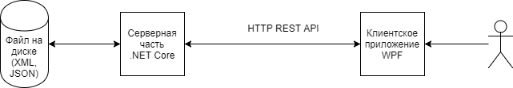

Клиент-серверное приложение
========================
## Основные требования задачи
> Серверное приложение работает по протоколу HTTP REST и использует .NET Core 3.0. Серверное приложение представляет из себя службу Windows или обычное Windows приложение, предоставляющее HTTP API для клиентского приложения. Клиентская сторона представляет Windows приложение с использованием технологии построения графических интерфейсов WPF .NET Framework 4.7.
> 
> 
## Требования по клиентской части (реализованно)
>- показ списка информационных карточек в GUI клиентского приложения с отображением графических изображений для каждой информационной карточки.
>- поддержка операций CRUD для информационных карточек.
>- обработка ошибок при работе с сервером.
>- графические изображения могут быть ф формате JPG, PNG.
>- сортировка информационных карточек по названию.
>- проверка ошибок ввода информационных карточке – пустое название и отсутствующее изображение.

## Требования по серверной части (реализованно)
>- загрузка информационных карточек из файла на стороне сервера. Формат файла – JSON.
>- сохранение добавленных и изменённых информационных карточек в файл на стороне сервера.
>- обработка запросов пользовательского GUI на CRUD операции с информационными карточками.
>- обработка ошибок при работе с клиентом.

# Скриншоты интерфейса

